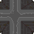
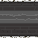
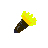
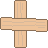

# **`The Maze Tower`**  a game by Jon Scarpelli

 

## **`Overview`**

---

_`The Maze Tower` is a throwback to early 90's freeware made with HTML, CSS & Javascript. The goal of the game is to navigate a seires of mazes using the arrow keys. Avoiding danger and using resources to make your way through to the end._

You play as Mazzy. A kid who got stuck at the bottom of a tower. To get out, Mazzy has to reach the top of the tower by traversing 3 levels of mazes and the escape out the top of the tower.

...Wait... what is Mazzy going to do from the top of a tower? Oh right... along the way you MUST locate the parachute. If Mazzy gets through all 3 levels of the tower without it... well the only taste of freedom Mazzy will have is the few seconds it takes to fall straight to the ground and... **`SPLAT!`**

Anyway, from a programming standpoint, the best feature is how simple it is to make levels. All the information to layout a level is in the first large array of objects called allLevels. It contains the locations of all walls, torches, ladders and other items for that level. It even passes the value for how long the level will remain lit before the lights go out!

  

## **`Gameplay`**

---

The game is played using the arrow keys to move Mazzy around the level to get Mazzy from the bottom of the level to the exit at the top. Each level is lit for a period of time that varies form level to level. For example the first level is lit or 60 seconds and then will go dark and you will have to use torches. Level 2 is lit for only a half second. Level three is lit for 3 seconds. Torches will be crucial. There are also a few items and elements to be aware of:

**Torches:** Collect a torch so that when levels get dark, Mazzy can see a few tiles around him. To use a torch, press T when it's dark. Torches last for about 4 seconds.
  

**Ladders:** Sometimes certain important areas are just blocked by a wall. Luckily the tower is filled with ladders. Grab a ladder and place it on a wall to get over the wall and over to the other side. To use a ladder, walk up to a wall, use the arrow key toward the wall you want to get over, then press L. Tada! Now you can move across the wall!
  

**Planks:** Pick up planks wherever you see them. They will save you from falling into a hole and dying! Once you have a plank, it will place itself as you walk onto a hole. Holes look like the following...
  

**Hole:** Don't fall in the hole.
  

**Coins** It's money. Pick it up!
  

**Exit:** Head toward the exit..... because... it's an exit.

**Exit:** Finally, the parachuite. Find this item to succesfully fininsh the game. If you don't you will get to the top of the tower and Mazzy will fall to his death!

   

## **`Links, Credits and other Information`**

---

_Project files and Production links:_

- [The Maze Tower](https://the-maze-tower.surge.sh/) - Link to deployed App.
- [The Maze Tower production Trello Board](https://trello.com/b/rfFDmLX2/js-maze-walker)
- [The Maze Tower Repo on GitHub](https://github.com/jscarpelli3/Jon-Scarpelli_The-Maze-Tower)
     

---

## Future Improvements

 

I have MANY ideas for additional features. Firstly, new levels are easily added, so I'm hoping to add at least 10 more levels (so it's actually a tower!). Also, the torch feature can be made more robust. Alter the interval of time at higher levels. Special torches make larger sighted area. Certain levels maybe have periodic light and dark.

The biggest thing I want to do is make make a level designer for the user. Currently it's easy to make levels, so I think it would be easy-ish to create a grid and allow the use to select where they would like a wall/torch/ladder etc...

---

## Credits

The Maze Tower was created, designed & programmed by Jon Scarpelli 
The art for the game is also by Jon Scarpelli 
The main game music is by Jon Scarpelli

The sound effects and other music is from pixabay.com 
The background Image on the index.tml was taken from: https://opengameart.org/content/castle-in-the-dark 
The background image behind the game was taken from: https://blenderartists.org/t/pixel-dungeon-3d/1286296

  

